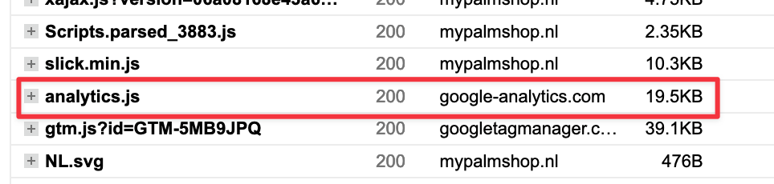

There was once a time where your only option for web analytics tools was (realistically) Google Analytics. Through the years Google Analytics has been growing and growing to provide more insights for websites like e-commerce.

## What is Plausible?
Plausible describes it themselves like this:

> Plausible: Simple web analytics tool you can use to measure site traffic 

and their goal:

> The goal of Plausible Analytics is to provide you all the valuable and actionable website traffic metrics at a glance in a simple and modern web analytics dashboard.

At this point you should already be hooked like I was.

## Why I like Plausible

I love minimalism in the tech industry. I think something is perfect, [if it matches the definition of perfection by Antoine de Saint-Exupéry](https://www.goodreads.com/quotes/19905-perfection-is-achieved-not-when-there-is-nothing-more-to):

> “Perfection is achieved, not when there is nothing more to add, but when there is nothing left to take away.”

and this is why I like Plausible. For me, it strikes the perfect balance between what I need and everything else is left out.

But does that mean it is also perfect for you? As I said, **in my usecase**, it is perfect. Since everyone their usecase is different, it might be too minimal for some people. If I have an e-commerce shop in a highly competitive market with low margins I would need to squeeze every bit of competitive edge I can. If all of my competitors use Google Analytics with its plethora of analytics, I would probably lose some ground. Because information is gold.

For my innocent blog? Plausible seems perfect.

## Lightweight script, really.

## Other things I like

- European made & hosted. With much software being made & hosted in the USA and [therefore being subject to the partiot act.](https://en.wikipedia.org/wiki/Patriot_Act)
- Donates 5% of their gross reveneu to environmental causes and open source
- Open source
- No paid advertising (this one really surprised me as someone who is activate in the e-commerce world) and [they even have a list of things they do not do.](https://plausible.io/blog/best-marketing-practices)

## Pricing

Just read it and tell me how you *cannot* like this:

## Conclusion

- The folks are awesome
- European based
- Good pricing
- should be a 5k per month tier for 4-5 euro, perfect for bloggers

